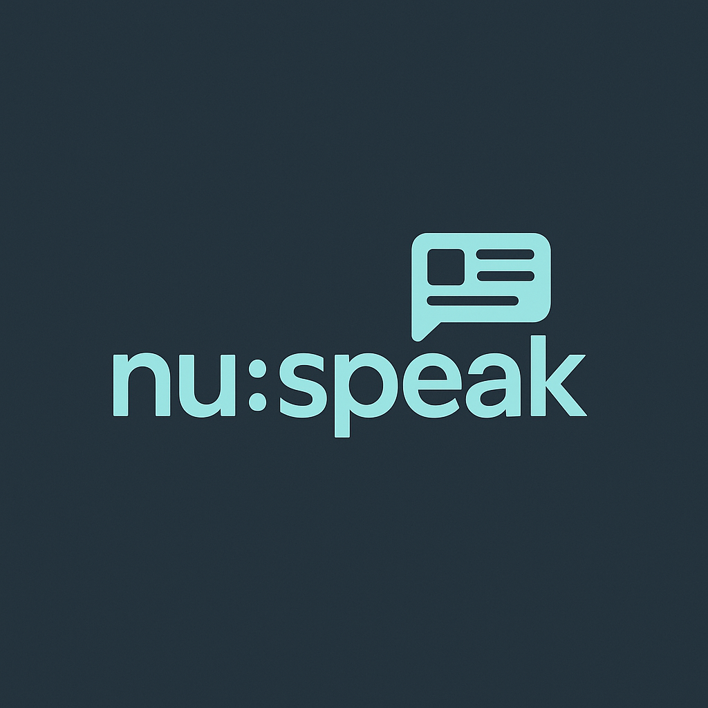
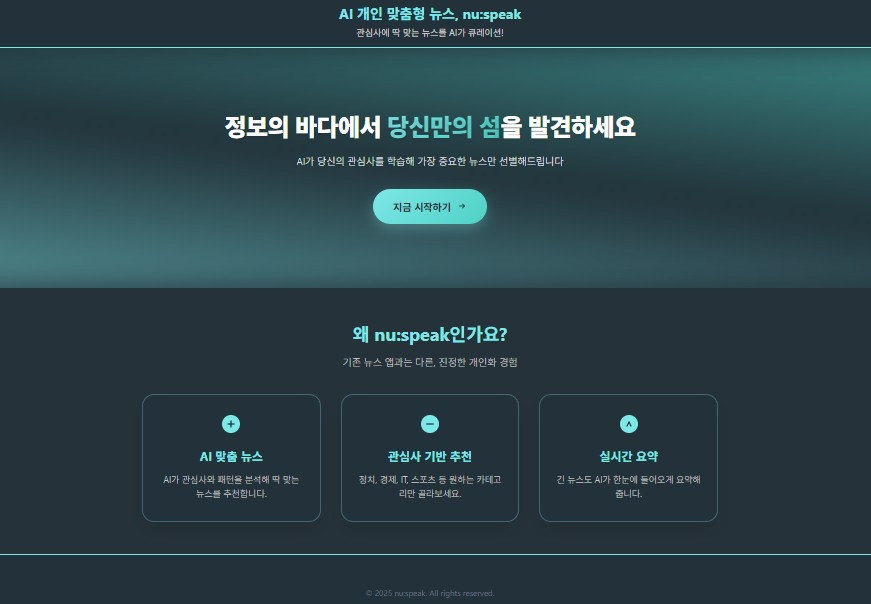
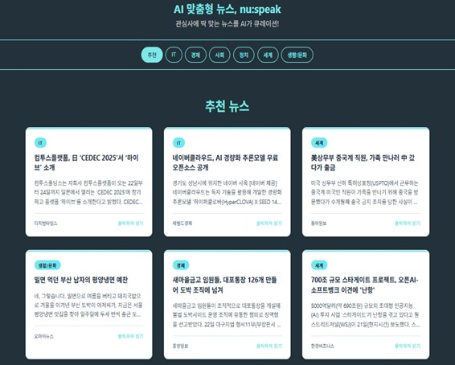
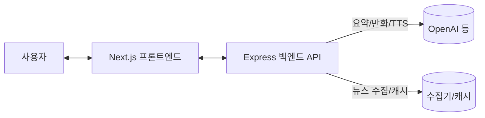

<p align="center">  </p> 
<h1 align="center">nu:speak — AI 개인 맞춤 뉴스 에이전트</h1> <p align="center"> EQ 슬라이더로 관심도를 조절하고, <b>요약 · TTS · 4컷만화</b>로 뉴스를 가볍게 소비하는 차세대 뉴스 플랫폼 </p> <p align="center"> <a href="https://github.com/jini-c/nu-speak/stargazers">  </a> <a href="https://github.com/jini-c/nu-speak/issues">  </a>     </p> <p align="center"> <a href="#-핵심-기능">핵심 기능</a> · <a href="#-프로젝트-구조">프로젝트 구조</a> · <a href="#-디자인--브랜딩-스토리">디자인 & 브랜딩</a> · <a href="#-스크린샷">스크린샷</a> · <a href="#-환경변수">환경변수</a> · <a href="#-빠른-시작">빠른 시작</a> · <a href="#-api-요약">API 요약</a> · <a href="#-아키텍처">아키텍처</a> · <a href="#-기술-스택">기술 스택</a> · <a href="#-로드맵">로드맵</a> · <a href="#-문서">문서</a> · <a href="#-contributing">Contributing</a> · <a href="#-라이선스">라이선스</a> · <a href="#-크레딧">크레딧</a> </p>

---

## ✨ 핵심 기능

개인화 피드: EQ 슬라이더(예: IT 60%, 경제 25%, 스포츠 15%)를 실시간 반영해 비중/정렬 조정

AI 콘텐츠 가공: 1줄/3줄 요약, TTS(음성), 4컷 만화 변환

대화형 에이전트: “오늘 IT 뉴스 알려줘” → 피드/요약/관련 기사 제공

저장 & 알림(설계): 북마크, 키워드 알림

---

## 🧭 프로젝트 구조

리포 루트 아래 nuspeak/ 폴더에 실제 소스가 있습니다.

```text
nuspeak/
├─ backend/                 # Express API 서버
│  ├─ routes/               # /news, /ai, /auth 등
│  ├─ services/             # 수집·요약·만화·TTS 연동
│  ├─ app.js
│  └─ .env.example          # 실제 키는 .env
├─ frontend/                # Next.js 웹
│  ├─ pages/ components/ public/ styles/
│  └─ tsconfig.json, package.json
├─ docs/                    # 문서/이미지
│  ├─ nuspeakLogo.png
│  ├─ screen-landing.jpg    # 랜딩 스크린샷
│  └─ screen-feed.jpg       # 피드 스크린샷
└─ README.md, .gitignore, SETUP.md

```

---

## 🎨 디자인 & 브랜딩 스토리

**진행 방식**  
브랜드 콘셉트 수립부터 로고, 컬러 시스템, 타이포그래피, 핵심 컴포넌트/화면 설계까지 **제가 중심이 되어** 일관되게 진행했습니다. 진행 과정에서 팀의 피드백을 반영해 방향을 계속 다듬었고, Cursor 등 도구는 **보조적으로만** 사용했습니다.

**디자인 시스템 하이라이트**
- 정보 구조: 카드형 뉴스, EQ 슬라이더, 태그/배지, 토스트, 스켈레톤 로딩
- 비주얼: 4/8 spacing, 2xl 라운드, 소프트 섀도
- 타이포: Headline / Body / Meta 위계 분리, 가독성 우선
- 접근성: 명도 대비, 포커스 표시, 반응형 레이아웃 고려

---

## 🖼️ 스크린샷
<p align="center">  </p> <p align="center"><em>랜딩: “정보의 바다에서 당신만의 섬을…” 메인 메시지 + ‘지금 시작하기’ CTA</em></p> <p align="center">  </p> <p align="center"><em>피드: 관심사 탭 전환, 카드형 뉴스(카테고리 태그 · 요약 · 출처 · 메타)</em></p>

---

## ⚙️ 환경변수

### `backend/.env`  _(실제 값은 여기에, 커밋 금지)_
```bash
OPENAI_API_KEY=
GOOGLE_TTS_API_KEY=
PORT=4000
```
```bash
frontend/.env.local (브라우저에 공개 가능한 값만)
NEXT_PUBLIC_API_BASE_URL=http://localhost:4000


주의: NEXT_PUBLIC_ 접두사는 브라우저에 공개됩니다. 비밀키는 넣지 마세요.
```

---


## 🚀 빠른 시작

```bash
# 백엔드
cd nuspeak/backend
npm install
npm run dev   # http://localhost:4000
```
```bash
# 프론트엔드
cd ../frontend
npm install
npm run dev   # http://localhost:3000
```
---

## 🔌 API 요약

```http
GET /news/feed?limit=10&page=1
PUT /users/eq-settings
POST /chat/message
POST /ai/summary 
POST /ai/comic
POST /ai/tts
```
상세는 docs/API 명세서.docx 참고.

---

## 🧠 아키텍처


---

## 🧩 기술 스택
-Frontend: Next.js(SSR/SSG), TypeScript, CSS Modules
-Backend: Node.js + Express
-AI/ML: OpenAI API(요약/대화), TTS API
-DB/Caching(설계): PostgreSQL, Redis
-CI/CD(옵션): GitHub Actions, Vercel/Render

---

## 🗺️ 로드맵

 EQ 디바운스(0.5s) & 실시간 미리보기

 Redis 캐시로 피드 응답 속도 개선

 북마크/키워드 알림 API

 4컷 만화 프롬프트 템플릿 고도화

 모바일 앱 PoC(여유 시)

---

## 📚 문서

docs/Nu_Speak_기획서_V2.docx, docs/사용자 시나리오.docx,
docs/와이어프레임 구성 가이드.docx, docs/API 명세서.docx,
docs/발표자료_nuspeak_최종.pptx, docs/출력물 패키지.docx

---

## 🤝 Contributing

PR 환영합니다. 버그/개선 제안은 Issues로!

---

## 📄 라이선스

MIT

---

## 🙌 크레딧

Product · Design · Frontend: jini-c

기획/자료 정리 & 리뷰: 팀 nu:speak — 한국폴리텍대학 정수캠퍼스 AI소프트웨어과